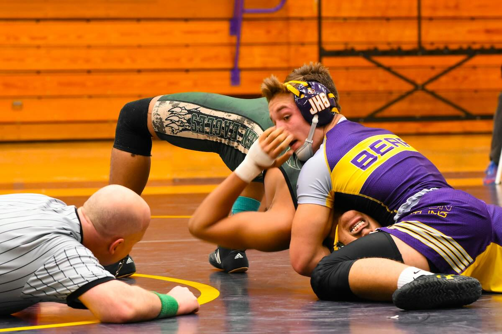

# Collab2
Leland Pulido, I will be adding a link explaining how scoring works in
[wrestling](https://keepthescore.com/blog/posts/wrestling-scoring/)

# Training:
In the sport you must do lots of muscle endurance and cardio based training while also working to be as explosive as possible.

Typically in the sport lots of wrestlers do calisthenics.
A simple workout routine would be 100 push up, sit up, squats, and a 20 minute run.

Every now and then there will be nonstop fullbody workouts.

# Typical practice
The most important thing for the sport is Technique! 90% of your practice should be drilling techniques. Having muscle memory is important for quick decisions and will help you defend or attack your opponent more efficiently.